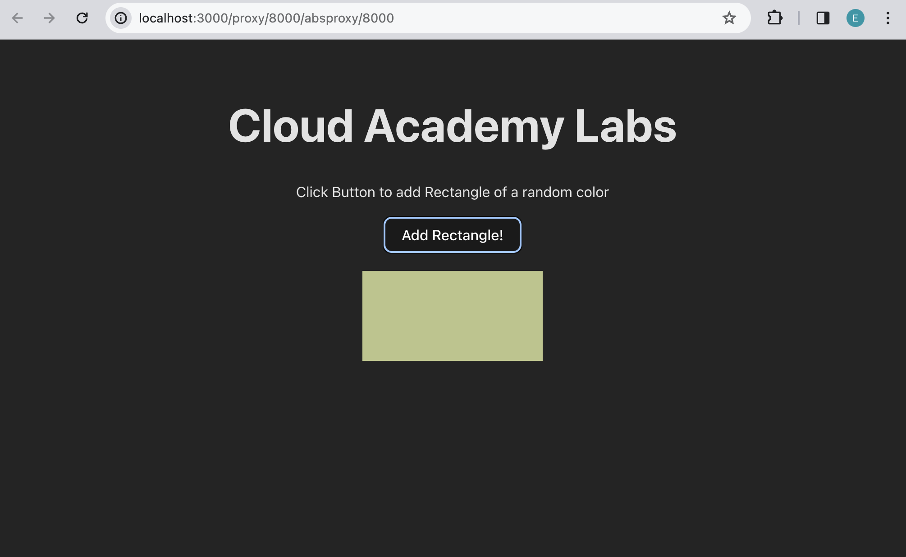
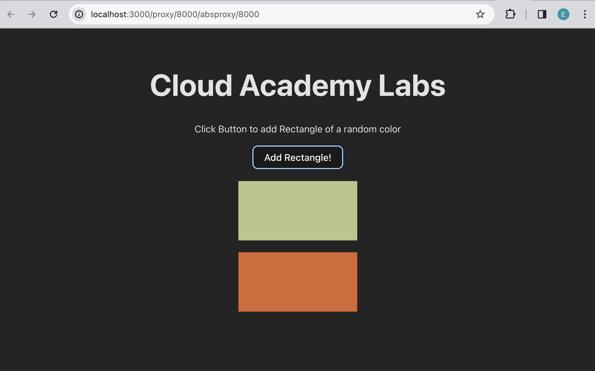

# React - Introduction to State and useState

## Setup 
Before we begin writing code, let's setup the project and install all necesarry packages.
Open a new Terminal window and do the following steps:

1. Go to `calab` directory:
    ```
    cd calab
    ```
2. Install npm packages:
    ```
    npm install
    ```
3. Start the application:
    ```
    npm run dev
    ```
    You should see the development server being started:
    []() 

    If you open the `Local` URL in a new browser tab, you should see the follwoing:
    []()    


## Steps 

1. Create a new Components called `Rectangle`.
    -   Create new directory called `components` inside `calab/src`.
    -   Inside `components` create new file called `Rectangle.jsx`.
    -   Add the following code to `Rectangle.jsx`:
        ```
        function Rectangle(props) {
            return (
                <div>
                <div
                    style={{
                    width: '200px',
                    height: '100px',
                    backgroundColor: props.color,
                    margin: '20px auto',
                    }}
                ></div>
                </div>
            );
        }
        export default Rectangle;
        ```

2. Open `App.jsx` and import the `Rectangle.jsx` component.
    -   Above the app() function import `Rectangle` from `'./components/Rectangle'`
        ```
        import Rectangle from './components/Rectangle';
        ```

3. Now that `Rectangle` component is imported, let's use it. After the `<h1>` element, let's insert the rectangle by creating `<Rectangle/>`.
    ```
    <Rectangle color="#123456" />
    ```

    NOTE: Pass any color string for now (e.g. '#123456'). We will revisit this in the next step.

4. Create a helper function that generates random color.
    -   Above the app() function create another function called `getRandomColor` to generate a random color in hexadecimal format.
        ```
        // Function to generate a random color in hexadecimal format
        const getRandomColor = () => {
            const letters = '0123456789ABCDEF';
            let color = '#';
            for (let i = 0; i < 6; i++) {
                color += letters[Math.floor(Math.random() * 16)];
            }
            return color;
        };
        ```

5. Update `<Rectangle/>` element to make use of this helper function.
    -   Replace `color="#123456"` with the call to the helper function.
        ```
        <Rectangle color={getRandomColor()} />
        ```
        NOTE: Refresh the page and see how color of the Rectangle changes each time.

6. Insert button and it's explanation between `<h1>` and `Rectangle`.
    -   Insert element `<p>` with the follwoing text "Click Button to add Rectangle of a random color" 
        ```
        <p>Click Button to add Rectangle of a random color</p>
        ```
    -   Insert element `<button>` called "Add Rectangle!"
        ```
        <button>Add Rectangle!</button>
        ```

        NOTE: Once button is clicked, nothing is yet happening 

7. Create `onClickHandler` function to handle button click events.
    - Inside App() function just before it's return statement, create a new function called `onClickHandler`
        ```
        const onClickHandler = () => {
        }
        ```
    - Update `<button>` element to call this function when button is clicked.
        ```
        <button onClick={onClickHandler}>Add Rectangle!</button>
        ```

8. Make use of React hook `useState` to keep track of colors.
    -   Import `useState` react hook.
        ```
        import React, {useState} from 'react';
        ```
    -   Inside App() function just before the `onClickHandler` function declare the state variable. Set empty array as the default value for colors state variable.
        ```
        const [colors, setColors] = useState([]);
        ```
 
9. Update the state of random color list with new color once button is clicked.
    -   Inside `onClickHandler` add new color to the existing list of colors and update the state.
        ```
        const onClickHandler = () => {
            const newColors = [...colors, getRandomColor() ]
            setColors(newColors);
        }
        ```

10. Update how we render `<Rectangle/>`. Create a separate `<Rectangle/>` for each color that is found in a array stored in a state.
    - Replace current `<Rectangle/>` element with a List of rectagle elements for each color in a state.
        ```
        {colors.map((color) => (
            <Rectangle key={color} color={color} />
        ))}
        ```


If you followed the steps correctly you should see the following when you run your react application:
[]()  

Once clicked on `Add Rectangle!` button you should see the follwoing:
[]()  

NOTE: colors may be different!

Once clicked on `Add Rectangle!` button again, you should see the follwoing:
[]()  